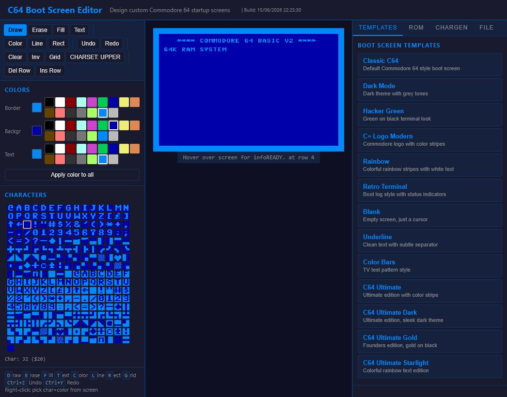
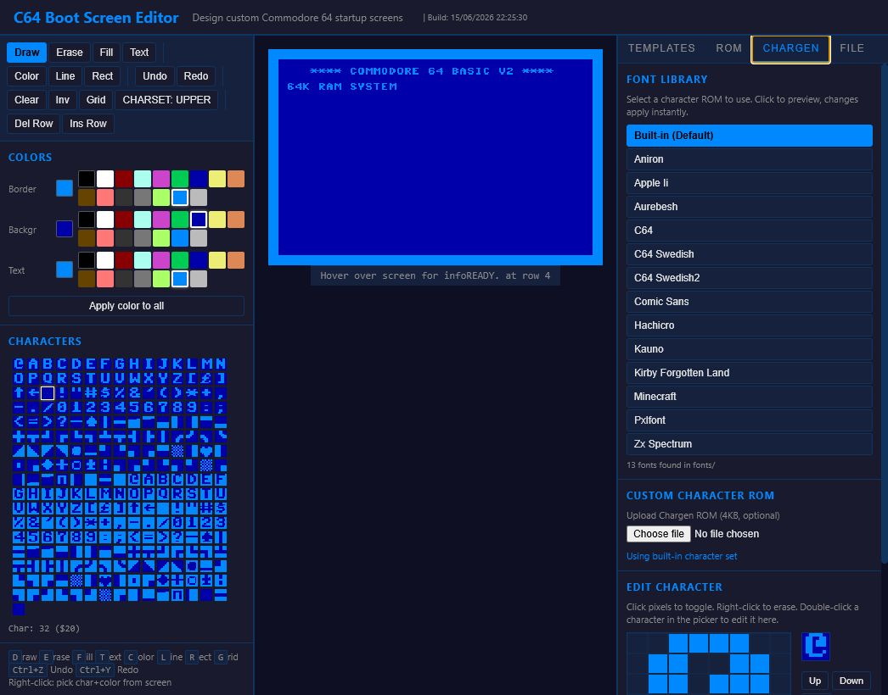
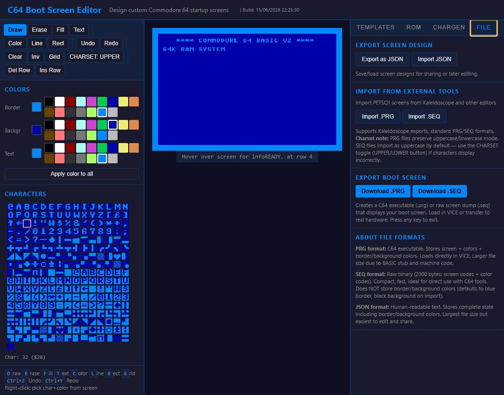

# C64 Boot Screen Editor

[GitHub repository](https://github.com/DrWize/CustomC64StartScreen)

A browser-based tool for designing custom Commodore 64 startup screens. Draw PETSCII art, pick from templates, edit character ROMs, and patch your KERNAL ROM with the result.

## Screenshots



| Character ROM editor | Import and export |
| --- | --- |
|  |  |

## Setup

1. Clone this repo
2. Run `download-fonts.ps1` on Windows or `download-fonts.sh` on Linux/macOS to populate the optional font library.
3. Open `index.html` in your browser — or use the included server script for the font library

To download all optional local dependencies in one go, including fonts, ROM
manifests, and the portable VICE emulator, see [DEPENDENCIES.md](DEPENDENCIES.md)
or run `download-dependencies.ps1` / `download-dependencies.sh`.

The editor works directly from the filesystem (`file://`), but the **font library** needs a local server to scan the `fonts/` directory. 

### Option 1: Docker (Recommended)

The easiest and most reliable way to run the editor with full font library support. The Docker container includes Apache HTTPD with auto-indexing enabled, which allows the font library to scan the `fonts/` directory.

**Using the startup scripts (Recommended):**

```bash
# Linux/macOS
./start-server-docker.sh [port]

# Windows (PowerShell)
.\start-server-docker.ps1 [port]
```

The scripts automatically:
- Check if Docker is installed and running
- Build the Docker image with quiet mode
- Start the container with volume mounts for `fonts/` and `kernal/` directories
- Open the server on your specified port (default: 8064)

Example with custom port:
```bash
./start-server-docker.sh 8080
```

**Using docker-compose:**

```bash
# Start services (includes health checks)
docker-compose up

# Start in detached mode
docker-compose up -d

# Stop services
docker-compose down
```

The docker-compose configuration includes:
- Automatic volume mounting for `fonts/` and `kernal/` directories
- Health checks to ensure the server is running
- Automatic restart unless explicitly stopped

**Manual Docker commands:**
```bash
# Build the image
docker build -t c64boot-editor .

# Run the container with volume mounts
docker run --rm -it -p 8064:8064 \
    -v $(pwd)/fonts:/usr/local/apache2/htdocs/fonts:ro \
    -v $(pwd)/kernal:/usr/local/apache2/htdocs/kernal:ro \
    --name c64boot-editor \
    c64boot-editor
```

**Note**: Docker images now include automatic cache-busting — you no longer need `--no-cache` flag. Each build generates a unique layer that prevents stale caches.

### Option 2: Python HTTP Server

If you don't have Docker, you can use Python's built-in HTTP server:

```bash
# Linux/macOS
./start-server.sh

# Windows (PowerShell)
.\start-server.ps1
```

Then open http://localhost:8064 (pass a different port as an argument if needed).

## Features

### Screen Editor
- 40x25 character grid rendered on HTML5 Canvas using C64 chargen bitmap data
- **Drawing tools**: Draw, Erase, Fill, Text, Color Paint, Line, Rectangle
- **Row operations**: Delete Row (shifts rows up), Insert Row (shifts rows down)
- **Per-cell color**: each character can have its own foreground color from the 16-color C64 palette
- **Global colors**: border and background color pickers
- **"Apply color to all"** button to recolor all existing characters at once
- Right-click to pick character + color from screen
- Undo/Redo with full state history
- Rectangular selection with copy, cut, paste, and arrow-key movement
- Grid overlay toggle
- Uppercase/graphics and lowercase/uppercase character set toggle

### Templates
- **Boot screens**: Classic C64, Dark Mode, Hacker Green, C= Logo Modern, Rainbow, Retro Terminal, Blank, Underline, Color Bars
- **C64 Ultimate editions**: Ultimate, Ultimate Dark, Ultimate Gold, Ultimate Starlight

### Character ROM / Font Library
- **Auto-scans** the `fonts/` directory on startup — drop any `.bin` file in and refresh
- Click any font to instantly switch the screen and character picker
- Upload your own 4KB chargen ROM via the Chargen tab
- **8x8 pixel editor** for individual characters with shift, mirror, invert, clear operations
- Download modified chargen ROM

### ROM Patching
- **Simple mode**: change startup text (Line 1 + Line 2) and colors in the KERNAL ROM
- **Extended mode**: inject a full PETSCII boot screen into the KERNAL ROM using RLE-compressed 6502 machine code
  - Overwrites the standard RS-232 NMI/Tx/Rx area at `$EEBB`-`$F0BC`
  - Hooks into the KERNAL startup at `$E39A`, replacing the banner print routine
  - Auto-detects cursor position: BASIC's "READY." prompt lands 2 rows below your design
  - Sets text color for READY. to match your design's dominant color
  - Jumps to BASIC warm start (`$A644`) for normal input loop
- **ROM recognition**: uploaded KERNALs are fingerprinted with CRC32 and matched against the known compatibility list
  - Known standard C64 rev. 1/2/3 KERNALs are marked safe for simple and extended mode
  - Known DolphinDOS/DolphinDOS2 KERNALs allow simple mode but block extended mode because their fastload code uses `$EEBB`-`$F0BC`
  - Known localized or less-tested KERNALs show a VICE-test warning before extended patching
  - Unknown KERNALs show a visible warning with their CRC32; extended mode requires confirmation or is blocked if the standard `$E39A` hook is missing
- **Timestamped exports**: All downloads (KERNAL ROM, .PRG, .SEQ, .JSON, Chargen ROM) now include date/time in filenames for automatic uniqueness (e.g., `kernal-extended-2026-06-15T12-30-45.bin`, `bootscreen-2026-06-15T12-30-45.prg`)
- **Status bar** shows where the cursor/READY. will appear after boot

### Export & Output Formats

- **Live preview** — opens the current design in a scalable CRT-style preview and can immediately download an emulator-ready PRG

- **Patched KERNAL ROM** (.bin) — This is what you want for actually changing your boot screen. Upload your original KERNAL ROM in the ROM tab, design your screen, then download the patched `.bin`. In VICE: Settings > Machine > KERNAL and point to your patched file. On real hardware: burn to EPROM.
  - *Simple mode*: changes startup text + colors only
  - *Extended mode*: injects your full PETSCII screen design with custom 6502 code
- **.PRG file** — A standalone C64 program for quick preview/testing. Load it in VICE with `LOAD "BOOTSCREEN.PRG",8,1` then `RUN`. Displays your screen and waits for a keypress, then returns to BASIC. This does NOT modify your KERNAL — it's just for previewing. Filenames include timestamps for uniqueness.
- **SEQ file** (.seq) — Raw screen + color data (2000 bytes). Compact format for C64 tools. Does NOT store border/background colors.
- **JSON** — Export/import screen designs for sharing or later editing. Preserves complete state including border/background colors.
- **Chargen ROM** (.bin) — Download modified character set for use as a replacement chargen ROM. Filenames include timestamps.

### Import from External Tools

**Kaleidoscope Support**: The editor can import screen designs from Kaleidoscope. Get it from [CSDB](https://csdb.dk/release/?id=257846) or follow updates at [KSReloaded Facebook](https://www.facebook.com/ksreloaded/).

- **.PRG files**: Import Kaleidoscope-exported PRG files containing screen data (with or without color RAM). PRG files preserve border/background colors.
- **.SEQ files**: Import Kaleidoscope SEQ files (screen + color data). SEQ files do NOT store border/background colors and default to blue border/black background on import. Use the CHARSET toggle (UPPER/LOWER button) if characters display incorrectly.
- **How to use**: In the File tab, click "Import .PRG" or "Import .SEQ" and select your file. The design will load directly into the editor.
- **Note**: Imported designs use uppercase/graphics character set by default. Use the CHARSET button to toggle between uppercase and lowercase modes.

### Keyboard Shortcuts
| Key | Tool |
|-----|------|
| D | Draw |
| E | Erase |
| F | Fill |
| T | Text mode |
| C | Color paint |
| L | Line |
| R | Rectangle |
| S | Select area |
| G | Toggle grid |
| Arrow keys | Move selection |
| Ctrl+C / Ctrl+X / Ctrl+V | Copy / cut / paste selection |
| Ctrl+Z | Undo |
| Ctrl+Y | Redo |
| Right-click | Pick char + color from screen |

## Typical workflow

1. Choose a template, import a design, or start with a blank screen.
2. Draw with the tool palette and use Select to copy, cut, paste, or move areas.
3. Optionally choose a character ROM or edit individual 8x8 glyphs in the Chargen tab.
4. Use Live Preview while designing.
5. Export JSON for later editing, PRG for VICE/real-hardware preview, or patch a compatible KERNAL ROM.

If the font library is empty, run one of the local server options above and refresh. Direct `file://` use cannot scan the `fonts/` directory.

## Developer Functionality

### Cache Busting

The editor includes a **dynamic cache buster** to prevent browsers from loading stale CSS and JavaScript files during development. This feature is enabled by default.

**How it works:**
- All asset URLs (CSS, JS, favicon) automatically receive a `?v=<timestamp>` parameter
- The timestamp is generated dynamically using `Date.now()` (milliseconds since epoch)
- This ensures browsers always fetch the latest version of files

**Toggle cache busting:**
To disable cache busting, change the meta tag in `index.html`:
```html
<meta name="cache-buster" content="true">   <!-- Enabled (default) -->
<meta name="cache-buster" content="false">  <!-- Disabled -->
```

This is useful for development when you're frequently updating files, but can be disabled for production if desired.

## Usage

Just open `index.html` directly in your browser — no build step, no server required. Pure HTML/CSS/JS.
